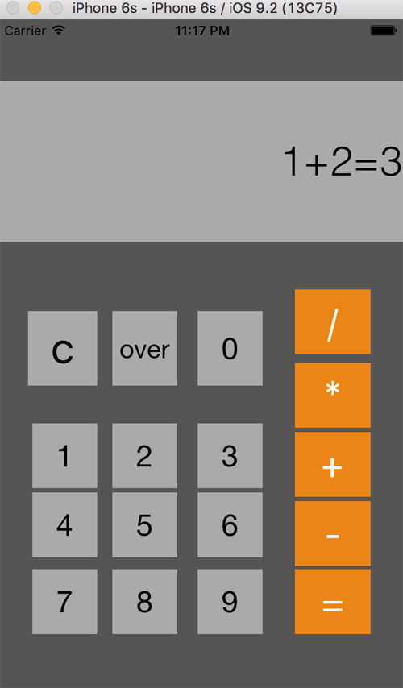

# CALCULATOR

学习ios开发入门的第一个小项目
照着 `《Programming in Objective-C 6th Edition 》`的内容敲了一遍，没有修改什么内容。虽然简陋，但最少运行起来了。

发上来是为了纪念下，笔记是第一个项目，小时候写作文不是常见写一篇`我的第一次什么什么的`嘛。

感觉就和多年前学习用C语言敲出第一句“hello world “一样的让人激动不易。再看多基本介绍的书，很快就可以入门ios开发了。

突然觉得自己学习能力还过得去，呵呵，在每天被加班到忘记公司规定是几点正常下班下，还可以抽出时间学点别的。
不过这样还是挺累的，没什么成就感，毕竟学了技术，不代表可以做出有感觉的好产品出来。

 

# 后记

1. 不习惯
打整个项目过程中，有点不习惯要打一堆的@@@@@ 和 返回的参数需要加括号   

	 -( NSString ) getShenMeGui( ){
		   return @"不要这个@可好" 
	 }
这和`java`的语法不是很一样，敲起来很生硬的，还需要点时间适应。
而且这`xCode`没有模糊匹配功能，得下载插件，还是`Intellij`好，不过他的`AppCode`还是得依赖`xCode`，用起来不是很爽。
不像用`Android Studio`那么行云流水般的流畅，呵呵，快捷键完全都没法用。

2. IOS的轮子就是好
 看了下哪些界面的效果和可以调的参数，真的是比安卓好太多了！

写着写着又好晚了，最近感冒咳嗽的，简直跪了。
就到这咯